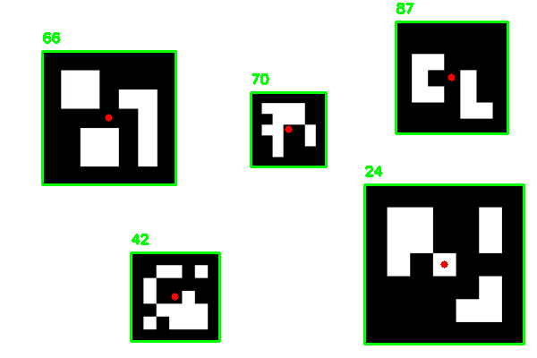

Totally forked from https://github.com/GSNCodes/ArUCo-Markers-Pose-Estimation-Generation-Python.  Check it out if you want more in depth!

Changes here are what we did to get it working right on Jetson Nano with some additional markers, and faster access to webcam.

To use this on the nano, follow these steps:
1. Run 'snapshot.py' to take like 15 pictures of your calibrated chessboard.  Before you start this process, make sure that the './targets' subdirectory is empty, this is where we'll save those files.
2. Run 'calibration.py' with a commmand line that looks like: python calibration.py --dir calibration_checkerboard/ --square_size 0.024
   -- notice that square size is in meters.  Also, this is set up for a checkerboard with width of 10 squares and height of 7, but the code will specify w as 9 and t (height) as 6 because it's only picking up inside corners on the board.  Feel free to adjust the code for your chessboard.
3. Print your chessboard - 8.5x11 paper is fine, 11x17 is better.  Make sure the squares are square, and that the proper size is entered when running calibration.py
4. When taking pictures, do so at a bunch of angles and orientations, but make sure the entire chessboard is visible and not blurred.

This will save two calibration numpy files, calibration_matrix and distortion_coefficients, necessary for your camera to interpret real 3D space.  They will overwrite old files.

5. Once you have those files, run something like python3 ./pose_estimation.py --K_Matrix calibration_matrix.npy --D_Coeff distortion_coefficients.npy --t DICT_4x4_50
   -- just remember to substitute the correct tag library (like 16H5) in at the end for --t
   
   Have fun!

-- I've left most of the old readme in place below.

ArUCo Marker Detection
The files `detect_aruco_images.py` and `detect_aruco_video.py` contains the code for detecting
ArUCo Markers in images and videos respectively. You need to specify the path to the image or 
video file and the type of marker you want to detect.

The command for running is :-  
**For inference on images**   
`python detect_aruco_images.py --image Images/test_image_1.png --type DICT_5X5_100`  
**For inference using webcam feed**  
`python detect_aruco_video.py --type DICT_5X5_100 --camera True `  
**For inference using video file**   
`python detect_aruco_video.py --type DICT_5X5_100 --camera False --video test_video.mp4`  

You can find more details on other parameters using `python detect_aruco_images.py --help`
and `python detect_aruco_video.py --help`

## 3. Calibration
The file `calibration.py` contains the code necessary for calibrating your camera. This step 
has several pre-requisites. You need to have a folder containing a set of checkerboard images 
taken using your camera. Make sure that these checkerboard images are of different poses and 
orientation. You need to provide the path to this directory and the size of the square in metres. 
You can also change the shape of the checkerboard pattern using the parameters given. Make sure this
matches with your checkerboard pattern. This code will generate two numpy files `calibration_matrix.npy` and `distortion_coefficients.npy`. These files are required to execute the next step that involves pose estimation. 
Note that the calibration and distortion numpy files given in my repository is obtained specifically for my camera 
and might not work well for yours.   

The command for running is :-  
`python calibration.py --dir calibration_checkerboard/ --square_size 0.024`

You can find more details on other parameters using `python calibration.py --help`  

## 4. Pose Estimation  
The file `pose_estimation.py` contains the code that performs pose estimation after detecting the 
ArUCo markers. This is done in real-time for each frame obtained from the web-cam feed. You need to specify 
the path to the camera calibration matrix and distortion coefficients obtained from the previous step as well 
as the type for ArUCo marker you want to detect. Note that this code could be easily modified to perform 
pose estimation on images and video files.  

The command for running is :-  
`python pose_estimation.py --K_Matrix calibration_matrix.npy --D_Coeff distortion_coefficients.npy --type DICT_5X5_100`  

You can find more details on other parameters using `python pose_estimation.py --help`  

## Output

  

### <ins>Notes</ins>
The `utils.py` contains the ArUCo Markers dictionary and the other utility function to display the detected markers.

Feel free to reach out to me in case of any issues.  
If you find this repo useful in any way please do star ⭐️ it so that others can reap it's benefits as well.

Happy Learning! Keep chasing your dreams!

## References
1. https://docs.opencv.org/4.x/d9/d6d/tutorial_table_of_content_aruco.html
2. https://docs.opencv.org/4.x/dc/dbb/tutorial_py_calibration.html
